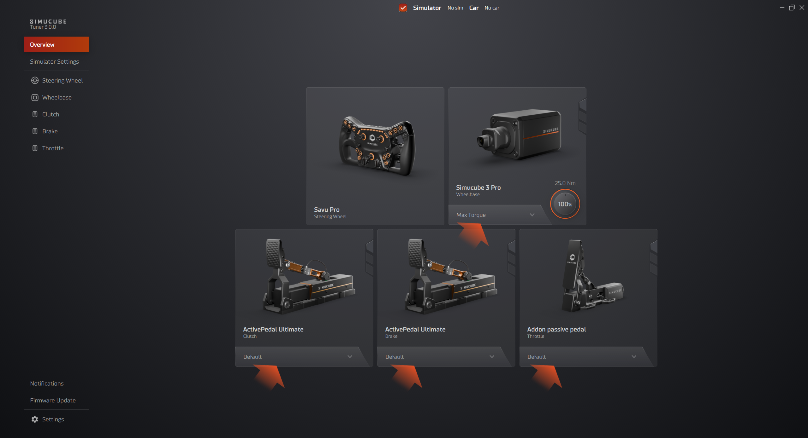
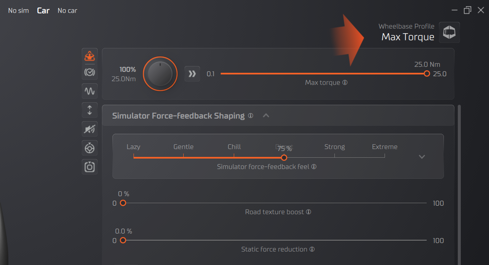

Tuner Software contains profiles for Wheelbase and Pedal devices. 

Profiles are quick and handy way to adjust parameters of your device to desired needs. Tuner contains built in default profiles, templates and even driver profiles, and creating your own profiles is also easy to do.

- Simucube 2 wheelbase profiles can be downloaded from **Paddock** (community-based profile sharing).
- Pedal profiles can be uploaded and downloaded from our discord server [Simucube Active Pedal Profiles](https://discord.gg/simucube).

!!! note "Note"
    You can [**Create shortcut for profiles**](../commandlineoptions.md).

Profiles have all the configurations of the device e.g. roles, force curves, effects and much more.

!!! warning "Warning" 
    Tuner software will automatically preserve changes made to the active profile, and reopening the software will restore all devices to the same settings that were used previously. This doesn't modify the saved version of the profile, which is only done when Save-button is pressed or when switching to different profile and saving the changes to the previous profile when prompted.
    
    Unsaved changes are indicated by the orange dot over the **profile button** which can be found in top right corner of the Configuration view or bottom button in device box in Overview.

## Profile Types

### Built-In Profiles

Tuner 3.0 includes professional profiles:

- **Driver Profiles**: Settings from professional sim racers
- **Car Type Profiles**: Optimized for Formula, GT, Rally, etc.
- **Game Profiles**: Specific to popular simulators

Built-in profiles are read-only but can be duplicated and customized. Built-in profiles are found easily through "Simucube Presets" in [Profile Handling.](profilehandling.md#collections)

### User Profiles

Your custom configurations:

- Full control over all settings
- Can be edited, renamed, deleted
- Export for backup or sharing
- Import from community

User profiles are found easily through "My Profiles" in [Profile Handling.](profilehandling.md#collections)

## Managing/Editing Profiles

!!! Tip "To access the profile edit:"
    1. Open a device configuration view
    2. Top right corner has a profile name, clicking the icon

### Creating New Profile

**From Scratch:**

1. Click "New Profile" in profile menu
2. Name your profile
3. Configure all settings
4. Click "Save"

**From Existing:**

1. Load a profile (built-in or user)
2. Click "Duplicate"
3. Rename the copy
4. Make your changes
5. Click "Save"

### Editing Profiles

1. Load the profile you want to edit
2. Make changes to any settings
3. Click "Save" or "Save As" to create new variant

!!! warning "Built-In Profiles"
    Built-in profiles cannot be edited directly. Duplicate them first to create an editable copy.

### Deleting Profiles

1. Select profile from profile menu
2. Click "Delete Profile"
3. Confirm deletion
4. Profile is permanently removed

!!! note "Note"
    Default or Simucube Presets cannot be deleted completely.

## Export/Import

### Exporting Profiles

1. Click "Export Profile"
2. Choose save location

**Use Cases:**
- Backup your settings
- Share with friends
- Transfer between PCs
- Archive favorite configurations

Export your profile and share via:

- Discord community
- Racing team
- Social media
- File sharing services

### Importing Profiles

**Method 1 - Drag and Drop:**
- Drag profile file from Explorer
- Drop onto Tuner window
- Profile automatically imports

**Method 2 - Import Button:**
1. Click "Import Profile"
2. Browse to profile file
3. Select and open
4. Profile added to your list

Downloaded profiles can be imported with drag-and-drop.

## Simucube 2 Paddock

!!! note ""
    Only visible with Simucube 2 wheelbases

- **Paddock**: opens a dialog which contains community made profiles for Simucube 2 wheelbases.
    - Only download is currently available true Tuner.
    - If you would like to upload Simucube 2 profiles to Paddock, use Simucube True Drive Software to do so.

### Tags

User can add tags which describe the profile and allow searching and categorizing profiles. Tags can be added either by pressing a section of Tags and selecting corresponding tag or by searching tags from tag categories by starting to write the name of a tag in the input field.

When a new tag is added to the profile, the related tags are also added automatically. For example, adding car class tag "Formula 1" will automatically also add "Open wheel" tag. 

Tags can be removed by clicking the tag itself.

### Tag categories

- Simulator
- Car class
- Car
- Other

